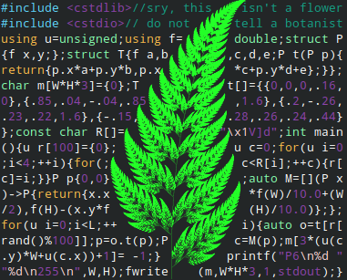

# 2: Flower

Challenge description:
> Create a program that draws a flower of your choice in whatever language you want (for example, I'll be using turtle graphics in Python). I'll post my solution 24 hours from now. Have fun! (✿◡‿◡)

## Entry:

